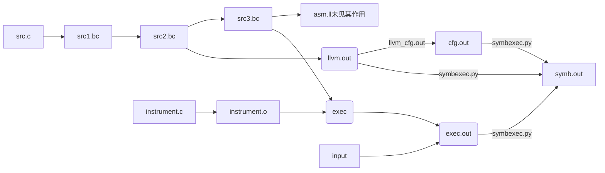
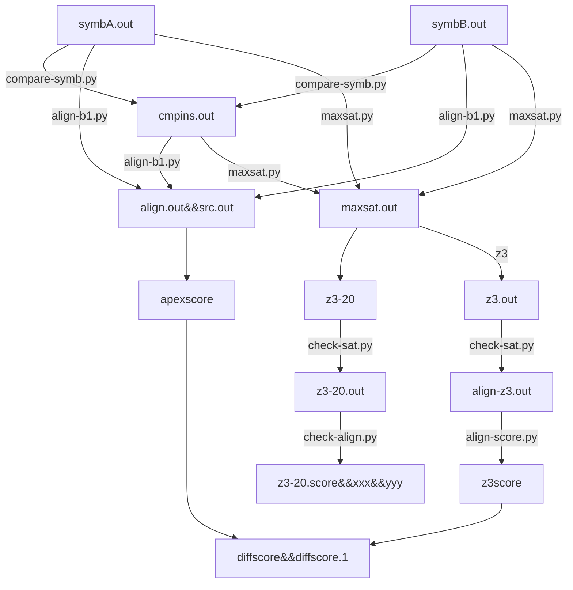

# APEX文件依赖与生成关系流程图

A、B文件夹中的流程图

```mermaid
graph LR
A[src.c]-->B[src1.bc]-->C[src2.bc]-->D[src3.bc]-->asm.ll未见其作用
C-->F(llvm.out)-->|llvm_cfg.out|cfg.out
G[instrument.c]-->H[instrument.o]
H-->I(exec)
D-->I
J[input]-->K(exec.out)-->|symbexec.py|symb.out
I-->K
cfg.out-->|symbexec.py|symb.out
F-->|symbexec.py|symb.out
```

result文件夹中的流程图

```mermaid
graph TD
symbA.out-->|compare-symb.py|cmpins.out
symbB.out-->|compare-symb.py|cmpins.out
symbA.out-->|align-b1.py|align.out&&src.out
symbB.out-->|align-b1.py|align.out&&src.out
cmpins.out-->|align-b1.py|align.out&&src.out-->apexscore-->diffscore&&diffscore.1
symbA.out-->|maxsat.py|maxsat.out
symbB.out-->|maxsat.py|maxsat.out-->z3-20-->|check-sat.py|z3-20.out-->|check-align.py|z3-20.score&&xxx&&yyy
cmpins.out-->|maxsat.py|maxsat.out-->|z3|z3.out-->|check-sat.py|align-z3.out-->|align-score.py|z3score-->diffscore&&diffscore.1

```

