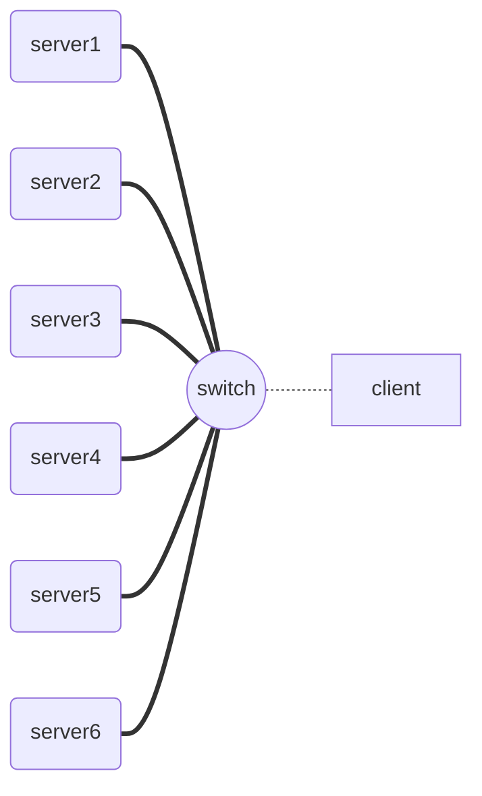

# <font face="楷体"><center>南京大学本科生实验报告</center></font>

<font size=3 face="楷体">课程名称：**计算机网络**													任课教师：李文中</font>

| <font face="楷体">学院</font>  | <font face="楷体">计算机院</font> | <font face="楷体">专业（方向）</font>  | <font face="楷体">计算机科学与技术</font> |
| ------------------------------ | --------------------------------- | -------------------------------------- | ----------------------------------------- |
| <font face="楷体">学号</font>  | 181860092                         | <font face="楷体">姓名</font>          | <font face="楷体">王瀚霖</font>           |
| <font face="楷体">Email</font> | 603102048@qq.com                  | <font face="楷体">开始/完成日期</font> | 2020.3.14  /  2020.3.14                   |


### <font face="楷体">1、实验名称</font> : Learning Switch

### <font face="楷体">2、实验目的</font>

<font size=4 face="楷体">	通过完成本实验中对learning switch的实现，了解并掌握learning switch的工作、自学习机制；通过完成三种不同的清除转发表中过期条目的机制，进一步理解learning switch对于网络拓扑变化的适应；</font>

### <font face="楷体">3、实验内容</font>：

### Task 1: Preparation

<font size=4 face="楷体">	实验要求：在switchyard下创建lab_2，在其中完成文件的复制与更名工作，做好实验准备；
	具体实现：略；</font>

### Task 2: Basic Learning Switch

<font size=4 face="楷体">	实验要求：修改文件`lab_2/myswitch.py`，实现一个最简单的，不涉及过期条目清理、不考虑转发表实际容量的learning switch；
	思考与实现：根据流程图显示，在这个learning switch中，收到数据包后首先要将此包中的src mac与收到包的interface记录到转发表中；之后，如果发现此数据包的dst是learning switch则直接丢弃，如果dst是表中没有记录过的地址，则洪泛此数据包，否则，dst在转发表中有记录，则只需从记录的对应interface中转发此数据包就可以了。
	观察框架代码可知，对于dst是learning switch与dst在转发表中没有记录两种情况已经得到了实现，所以我们只需实现转发表对src mac与对应interface的存储以及dst在转发表中的情况处理就可以了。
	首先是转发表对src mac与对应interface的存储：对于这种一一对应的关系，利用python中的dict结构最好处理；声明一个dict型变量mydict作为转发表，每次收到一个包，要将其src mac与接收到此包的interface记录到dict中，上述两个量分别对应于框架代码中的packet[0].src与input_port，所以通过`mydict[packet[0].src] = input_port`就可以实现记录；同时，这样的操作也实现了如果一个src mac对应的interface发生了变化，转发表中就会更新这个src mac对应的interface，同一个src mac也就不可能对应两个interface了；因此这种实现一定程度上也使得learning switch能够适应网络拓扑发生的一些变化；
	其次就是当dst在转发表中有记录时的处理了：通过in操作可以判断dst是否在记录表中，如果确定在，则只要从此端口转发就可以了，具体实现可参考文档**核心代码——Task2**内容；</font>

<font size=4 face="楷体">	关于**Testing**与**Deploying**参见文档**实验结果**部分；</font>

### Task 3: Timeouts

<font size=4 face="楷体">	实验要求：修改文件`lab_2/myswitch_to.py`，实现一个**Timeout Mechanism**下的learning switch；
	思考与实现：根据流程图显示并结合FAQ知，这个learning switch的工作流程为：每收到一个数据包后，首先会将转发表中过期（本实验中指距离条目被记录/上一次更新超过10s）的条目从表中删除（只在收到包时判断，没有用多线程实现），然后根据收到包的src mac与对应的interface在转发表中进行记录/更新（主要指更新src mac对应的interface），这时新的记录的elapsed_time为0；记录/更新完成后，就会进行数据包的转发：如果转发表中没有相应dst的记录则洪泛，否则从记录的interface中转发；当然，如果dst是switch则丢弃；要完成上述的工作流程，要解决两个问题：elapsed_time的获取与过期条目的删除。
	elapsed_time的获取：elapsed_time指的就是距离记录/上一次更新的时间，因此很自然可以想到`elapsed_time = 当前时间 - 记录/上一次更新的时间`。基于此，我采用了下述方法获取elapsed_time：每当记录/更新条目时，就将此条目中的timestamp设置为当前的时间；之后如果想获知此条目的elapsed_time，只需要用当前时间减去该条目中的timestamp就可以了。
	过期条目的删除：每次接收到一个数据包后，首先要删除转发表中过期的条目，所以就是遍历整个转发表，找到elapsed_time > 10s的条目删除。在实验中我采用dict类型来模拟转发表，dict的key是各主机的mac地址，而value是一个list，list[0]是interface，list[1]是timestamp；因为寻找过期条目需要遍历转发表找到，而dict类型不允许在遍历过程中删除，所以我又声明了一个list类型的to_be_delete来记录需要删除的条目。故删除过期条目的操作就是：接收到包后，利用`time.time()`获取当前时间now，遍历转发表，如果now - timestamp > 10 则说明过期，就将这个条目的key记录到to_be_delete中，然后遍历to_be_delete，删除转发表中相应的条目（删除后，to_be_delete要清空，为下一次删除做准备）。
	完成这些后，就需要用收到包的src mac与interface来对转发表进行记录/更新，而新的记录elapsed_time = 0，故操作为：`mydict[packet[0].src] = [input_port, time.time()]`；最后对于数据包的转发，与**Task2**完全一样，不再赘述。具体实现可参考文档**核心代码——Task3**内容；</font>

<font size=4 face="楷体">	关于**Testing**与**Deploying**参见文档**实验结果**部分；</font>

### Task 4: Least Recently Used

<font size=4 face="楷体">	实验要求：修改文件`lab_2/myswitch_lru.py`，实现一个**least recently used rule Mechanism**下的learning switch；
	思考与实现：根据流程图显示并结合FAQ知，这个learning switch的工作流程为：每收到一个数据包后，首先要判断收到包的src mac是否被记录，若转发表中有则对该条目进行更新，注意这里更新不能改变该条目的LRU order；如果没有就添加到转发表中：设置转发表容量为5，则如果转发表存储条目数不足5就直接添加，并且新添加条目的LRU order为 MRU；如果转发表存储条目数为5就需要将LRU order为 LRU 的条目删除，然后添加，并且新添加条目的LRU order为 MRU；最后，在转发数据包时，如果dst在转发表中被记录，则将dst对应的条目设置为 MRU。要实现上述流程，需要解决一个问题：如何表示LRU order。
	直观上理解LRU order，就是看该条目被使用的频率，换言之就是距离上一次被使用到的时间。基于此，在转发表mydict的value中设置age来表示该条目“距离上一次被使用到的时间”，显然age越小表示使用越频繁，age越大表示使用越不频繁；故age最小的就是 MRU，age最大的就是LRU，设置 MRU的age为0。每次接收到一个包，都要将转发表中所有条目的age加一，表示“距离上一次被使用到的时间”又增加了一个时间单位；这样，LRU order就可以被表示出来了。
	在上述基础上，设置一个dict类型变量mydict表示转发表，mydict的key是各主机的mac地址，value是一个list，list第一项表示interface，第二项表示age。代码的执行流程为：每收到一个包，将mydict中所有条目的age加一，然后判断收到包的src mac在不在转发表记录里：如果在，则保持age不变去更新该mac对应的interface（如果interface没有改变则`mydict[packet[0].src] = [input_port, age]`也不会改变相应的interface，只是重复赋了一次值）；为此要先将该src mac对应的条目的age取出并记录；如果src mac不在转发表里，就需要添加了：如果mydict容量小于5则直接添加，且age设为0；如果mydict容量等于5则要遍历mydict找出age最大的一个删除，然后添加新条目（新条目age为0）。完成这些后进行数据包的转发，与Task2相比，需要在dst在转发表中有记录的情况下增加一步操作：在从记录的相应interface转发的同时，将dst对应的条目的age赋值为0，这时为了使dst对应的条目设置为 MRU，可以先将转发表中所有条目的age加1，然后dst对应的条目的age赋值为0；这样就避免了新增项与dst对应的条目同时为 MRU。具体实现可参考文档**核心代码——Task4**内容；</font>

<font size=4 face="楷体">	关于**Testing**与**Deploying**参见文档**实验结果**部分；</font>

### Task 5: Least Traffic Volume

<font size=4 face="楷体">	实验要求：修改文件`lab_2/myswitch_traffic.py`，实现一个**Least Traffic Volume Mechanism**下的learning switch；
	思考与实现：根据流程图显示并结合FAQ知，这个learning switch的工作流程为：每收到一个数据包后，首先要判断收到包的src mac是否被记录，若转发表中有则对该条目进行更新：同Task4一样，更新时该条目的traffic_volume不可以更改；如果没有就添加到转发表中：设置转发表容量为5，则如果转发表存储条目数不足5就直接添加，并且新添加条目的traffic_volume为0；如果转发表存储条目数为5就需要将traffic_volume最小的条目删除，然后添加，并且新添加条目的traffic_volume为0；最后，在转发数据包时，如果dst在转发表中被记录，则将dst对应的条目中的traffic_volume加一。
	traffic_volume的意思已经很明白了：就是switch收到的、dst mac与转发表中记录的mac地址一致的数据包的个数；而对于这种情况，switch会从对应记录的interface中转发此数据包，所以只要在这种情况下转发数据包时将相应的条目的traffic_volume加一就可以了。同样的，设置一个mydict作为转发表，其key为各主机的mac地址，value为一个list，list[0]是interfce，list[1]是volume，代表traffic_volume；代码的执行流程为：每收到一个包，首先判断收到包的src mac在不在转发表记录里：如果在，则保持traffic_volume不变并去更新该mac对应的interface（如果interface没有改变则`mydict[packet[0].src] = [input_port, volume]`也不会改变相应的interface，只是重复赋了一次值）；为此要先将该src mac对应的条目的traffic_volume取出并记录；如果src mac不在转发表里，就需要添加了：如果mydict容量小于5则直接添加，且traffic_volume设为0；如果mydict容量等于5则要遍历mydict找出traffic_volume最小的一个删除，然后添加新条目（新条目traffic_volume为0）。完成这些后进行数据包的转发，与Task2相比，也只需要在dst在转发表中有记录的情况下增加一步操作：在从记录的相应interface转发的同时，dst对应的条目的volume应该加一。具体实现可参考文档**核心代码——Task4**内容；</font>

<font size=4 face="楷体">	关于**Testing**与**Deploying**参见文档**实验结果**部分；</font>

### <font face="楷体">4、实验结果</font>

#### Task1

<font size=4 face="楷体">	略。</font>

#### Task2

<font size=4 face="楷体">	deploying结果如下：
	按照手册中的步骤执行后，得到的结果为：</font>


<font size=4 face="楷体">**server1结果**</font>


<font size=4 face="楷体">**server2结果**</font>

<font size=4 face="楷体">	根据手册中的说明，ping产生的通信是client向server1发送2个"echo" request。起初client要向server1发送信息，但不知道server1的mac地址，所以会先发送一个ARP请求，这个APR请求被switch收到后，switch会将client的mac地址与收到这个包的interface记录到转发表中，同时将ARP请求包广播；server1收到这个广播后会返回一个回复告诉client自己的mac地址；这个APR回复数据包的src是server1，dst是client，所以switch收到这个包后，首先会将server1的mac地址与interface记录到转发表中；接着转发这个数据包，由于dst是client，已经在转发表中记录了，所以switch只会从与client相连的interface中发送这个数据包；这时switch的转发表中已经有了对server1和client的记录，所以之后server1与client之间产生的"echo" request与"echo" reply，以及最后server1向client发送的ARP确认都只会在`server1——switch——client`这条通路上进行。所以可以看到，wireshark对于server1捕捉到了上述全部过程，因为所有通信都会与server1相关；而wireshark对于server2只捕捉到了最开始广播的ARP请求，这是因为除了这一个数据包外，switch根据转发表中的记录转发数据，是不会将数据通过server2连接的interface发送的。这样的结果也说明了switch的转发逻辑是符合预期的。</font>

#### Task3

<font size=4 face="楷体">	testing结果如下：</font>


<font size=4 face="楷体">	deploying结果如下：
	为了验证learning switch的逻辑正确性，设计了以下通信：首先client向server1 ping一个数据，紧接着client再向server1 ping一个数据；之后在经过较长的时间（长于10s）后client再次向server1 ping一个数据；利用wireshark来捕捉server1和server2上的流量。
	根据Timeout Mechanism分析可知，第一次ping之前，会有ARP的请求与应答，在这个过程中client与server1的mac地址与对应interface就被记录到转发表中了，所以第二次ping执行时，对于ICMP协议下的通信，switch可以直接在正确的interface处转发数据包，因此server2应该无法收到任何数据；第三次ping时，转发表中之前记录的信息已经过期了，所以应该被删除，这时client再次ping server1，client和server中已经记录了对方的mac地址，所以不必再发ARP请求与回复，所以client会向server1发送Echo request，switch收到这个数据包后，因为转发表中条目都被删除了，所以switch会将client的mac与相应的连接client的interface记录下来，并将此数据包洪泛，之后server1收到Echo request会回复，这时switch会根据记录将此数据包从连接client的interface转发。
	在mininet上执行这些测试并利用wireshark捕捉server1与server2的流量得到：</font>

<font size=4 face="楷体">	执行开始的两次ping后得到结果为：</font>


<font size=4 face="楷体">	从上图可以看出，最初的两次ping中，server2只接收到了最初的ARP广播，之后所有的通信都是在`server1——switch——client`中进行的，符合上述分析；
	经过较长时间后执行第三次ping的结果为：</font>


<font size=4 face="楷体">	由上图可知，第三次ping中，server1仍然接收到了所有的通信，这其中包括ICMP协议下的通信，也包括ARP协议下的mac地址确认通信；而server2却接收到了client向server1发送的Echo request，这说明了client发送的这个Echo request被switch洪泛处理了，switch从server1与server2各自对应的interface中都进行了转发；对比第二次ping可以知道，如果转发表中有对server1的记录的话，这个数据包会被直接从server1连接的interface转发，server2就收不到了，所以转发表中的记录确实是被删除了。由此证明了timeout mechanism的实现是有效的。</font>

#### Task4

<font size=4 face="楷体">	testing结果如下：</font>


<font size=4 face="楷体">	deploying结果如下：
	考虑到实现的switch容量为5，而且测试过程中拓扑结构不会发生改变，所以需要修改`lab_02/start_mininet.py`中的拓扑结构，在原有的基础上增加server3-6，具体的修改方式在lab_01中有提到，这里不再赘述；实现后网络拓扑结构变为：</font>



<font size=4 face="楷体">	为了检验learning switch实现正确与否，设计以下通信过程：首先server1 ping server2，server3 ping server4，然后server5 ping server1，接着server5 ping server6，server1 ping server2；最后server3 ping server4.
	首先，server1 ping server2，server3 ping server4的结果如下：</font>


<font size=4 face="楷体">	从上图中可以看到，server1 ping server2的完整过程是server1发送一个ARP请求，然后server2回复，接着server1和server2互相通信，最后进行ARP确认；在这个过程中转发表中记录的顺序变化过程为：[1]->[1,2]->[2,1]->[1,2]->[1,2]->[2,1]；之后server3 ping server4的过程与server1 ping server2是一样的，所以这之后转发表中记录为：[4,3,2,1]；而且上述过程中除了最开始的ARP广播外两次ping是互不相干的，说明switch没有洪范而是根据转发表中记录进行转发；
	之后，server5 ping server1的结果为：</font>


<font size=4 face="楷体">	从上图中可以看到，执行server5 ping server1，实际的通信是server5向server1发送一个APR请求后server1回复，然后二者通信，最后再进行APR确定；同上面一样分析后，可知此时转发表中内容应该为[1,5,4,3,2]；同时，执行server5 ping server1后，server3的流量捕捉为：</font>


<font size=4 face="楷体">	从上图中可以看到，server3中只是多了一个ARP广播信息，因此对于server1与server5的通信，switch也是通过转发表查询进行而非洪泛的。
	接着，server5 ping server6：</font>


<font size=4 face="楷体">	从上图中可以看到，server5 ping server6的过程与之前的通信也是一样的，同样分析可知这时转发表中存储内容应该为[6,5,1,4,3,2]，考虑到转发表容量为5，因此LRU会被舍弃，即server2的相关记录会被删除；所以这时转发表中存储内容应该为[6,5,1,4,3]；同样的，server3中也只是多了ARP广播信息，说明switch没有洪范；
	接下来，server1 ping server2的结果为：</font>


<font size=4 face="楷体">	从上图中可以看到，server1 ping server2中，由于server1已经记录了server2的mac地址，所以不需要发送ARP请求，直接向server2发送数据包（server1的15行），switch接收到这个数据包后会查询转发表，查到记录为[6,5,1,4,3]，因为对于server2的记录已经被作为LRU删除了，所以switch会洪泛此数据包，这一点从server3中捕捉到了server1向server2发送的Echo request可以看出；这也反映了目前为止learning switch是work的；之后server1与server2会进行ARP确认，结束后转发表中内容应该为：[2,1,6,5,4]，server3的记录被删除，所以再次进行server3 ping server4，switch会将server3添加进转发表，从而删除server4的记录条目；server3已经知道了server4的mac故不需要ARP；故对于server3向server4发送的Echo request，switch没有server4的记录，应该将Echo request进行洪泛；server3 ping server4的结果如下，符合预期，从而说明了learning switch工作的正确性；</font>


<font size=4 face="楷体" color=red>	PS：由于测试过程中网络拓扑结构不会发生变化，所以无法测试某个mac对应于switch的interface发生变化的情况；另外由于ARP与ICMP下的请求与回复，无法通过wireshark捕捉结果说明“当数据包的dst在转发表记录中时，对应条目的age不变”这一处理方式（回复总使得双方的age都被更新）。</font>

#### Task5

<font size=4 face="楷体">	testing结果如下：</font>


<font size=4 face="楷体">	在Task4更改后的网络拓扑结构中检验learning switch实现正确与否，设计以下通信过程：首先进行两次server1 ping server2，然后server3 ping server4，接着执行3次server5 ping server6，再执行3次server5 ping server3，最后server3 ping server6，server3 ping server4.
	首先，进行两次server1 ping server2，然后server3 ping server4的结果如下：</font>


<font size=4 face="楷体">	结合上图显示的通信过程分析，两次server1 ping server2后，根据Least Traffic Volume机制，转发表中会记录server1和server2的情况，而且server1的traffic_volume为4（1次ARP应答、2次ICMP通信，1次ARP确认），server2的traffic_volume为3（2次ICMP通信，1次ARP确认）server3 ping server4后，转发表中增添了关于server3与server4的条目，server3的traffic_volume为3，server4的traffic_volume为2；故此时转发表中记录为：[server1:4 ,server2:3 ,server3:3 ,server4:2]；	接下来执行3次server5 ping server6后结果为：</font>


<font size=4 face="楷体">	结合上图显示的通信过程分析，首先server5发送一个ARP请求，switch收到后广播并且将server5记录到转发表中，其traffic_volume为0，之后server6发送回复，转发表检查到没有server6，所以会将表中traffic_volume最少的server5记录删除，添加server6，之后server5和server6的ICMP通信包括ARP确认都重复了上述操作，都是server5被删，server6添加或server6被删，server5添加；此过程中，dst在server5、server6中切换，而转发表总会将dst的记录在转发前删除掉，所以对于server5、server6之间的上述通信，switch都会将数据包洪泛，这一点从server1接收到了所有的通信过程这一点可以看出；结束后，转发表中内容为[server1:4 ,server2:3 ,server3:3 ,server4:2 ，server5：0]；接着执行3次server5 ping server3的结果为：</font>


<font size=4 face="楷体">	可以看出，由于server3和server5都被记录在转发表中，所以通信不会被洪泛，故server1只是收到了最初的一个ARP广播；经过这样的通信之后，server3与server5的traffic_volume都会增加，转发表内容变为：[server1:4 ,server2:3 ,server3:7 ,server4:2 ，server5：5]；
	接着执行server3 ping server6，结果为：</font>


<font size=4 face="楷体">	此通信中，server3首先发送一个ARP请求，接着server6发送ARP回复，这个通信使得switch将traffic_volume最小的server4的条目删除，添加进server6的记录，接着server3与server6进行ICMP通信、ARP确认，得到最后的转发表内容为：[server1:4 ,server2:3 ,server3:10 ,server6:2 ，server5：5]；在这个前提下进行server3 ping server4，不需要ARP请求，所以server3向server4发送的Echo request会被洪泛；而实验结果如下图所示，server1接收到了server3向server4发送的Echo request，符合预期；因此说明了learning switch是work的。</font>


### <font face="楷体">5、核心代码</font>

#### Task2

<font size=4 face="楷体">	本阶段的核心就是在框架合适位置添加/改写为以下代码：</font>

```python
# 1、声明转发表mydict，并增加在接收到数据包后添加/更新转发表中的内容：
……
	my_interfaces = net.interfaces() 
	mymacs = [intf.ethaddr for intf in my_interfaces]
	mydict = {}	#增加+++
……
       mydict[packet[0].src] = input_port	#增加+++
……

# 2、在原有的对dst进行判断并转发数据包的操作中增添dst在表中有记录的情况，更改后的处理流程为：
……
    if packet[0].dst in mymacs:
       log_debug ("Packet intended for me")
    else:
       if packet[0].dst in mydict:
       #添加对于dst在转发表中情况的处理
            net.send_packet(mydict[packet[0].dst], packet)
            log_info("send packet {} to {}".format(packet,mydict[packet[0].dst]))
            #只从mydict[packet[0].dst]转发packet
       else:	
            for intf in my_interfaces:	
                if input_port != intf.name:	
               	 	log_debug("Flooding packet {} to {}".format(packet,intf.name))
                	net.send_packet(intf.name, packet）
……

```

#### Task3

<font size=4 face="楷体">	本阶段的核心就是在框架合适位置添加/改动为以下代码：</font>

```python
# 1、声明转发表mydict与记录待删除条目的list:to_be_delete
……
	my_interfaces = net.interfaces() 
	mymacs = [intf.ethaddr for intf in my_interfaces]
	mydict = {}	#增加+++
    to_be_delete = []	#增加+++
……

# 2、增加转发表中过期条目删除以及转发表内容添加/更新的操作
……
        except Shutdown:
            return
        now = time.time()	#增加+++，用以获取当前时间
        for key in mydict.keys():	#增加+++
            if now - mydict[key][1] > 10:	#增加+++
                to_be_delete.append(key)	#增加+++
                #遍历转发表，记录所有过期条目
        for kill in to_be_delete:	#增加+++
            del mydict[kill]	#增加+++
            #删除过期条目
        to_be_delete.clear()	#增加+++，清空待删除项
        mydict[packet[0].src] = [input_port, time.time()]	#增加+++
        #添加新增项或更新已有项，elapsed_time设置为0

        log_debug ("In {} received packet {} on {}".format(net.name, packet, input_port))
……

# 3、在原有的对dst进行判断并转发数据包的操作中增添dst在表中有记录的情况，更改后的处理流程为：
……
    if packet[0].dst in mymacs:
       log_debug ("Packet intended for me")
    else:
       if packet[0].dst in mydict:
       #添加对于dst在转发表中情况的处理
            net.send_packet(mydict[packet[0].dst], packet)
            log_info("send packet {} to {}".format(packet,mydict[packet[0].dst]))
            #只从mydict[packet[0].dst]转发packet
       else:	
            for intf in my_interfaces:	
                if input_port != intf.name:	
                	log_debug("Flooding packet {} to {}".format(packet,intf.name))
               		net.send_packet(intf.name, packet）
……
```

#### Task4

<font size=4 face="楷体">	本阶段的核心就是在框架合适位置添加/改动为以下代码：</font>

```python
# 1、声明转发表mydict：
……
	my_interfaces = net.interfaces() 
	mymacs = [intf.ethaddr for intf in my_interfaces]
	mydict = {}	#增加+++
……

# 2、增加LRU order维持以及向转发表中添加/更新条目的操作：
       except Shutdown:
            return
        for key in mydict.keys():	#增加+++
            mydict[key][1] = mydict[key][1] + 1	#增加+++
            #每次收到包，转发表中所有条目的LRU order都加一，以维持LRU order的顺序

        if packet[0].src in mydict:	#增加+++
            age = mydict[packet[0].src][1]	#增加+++
            mydict[packet[0].src] = [input_port, age]	#增加+++
            #src mac有记录，保持age不变，对相应条目进行更新
        else:	#增加+++
            if len(mydict) < 5:	#增加+++
                mydict[packet[0].src] = [input_port, 0]	#增加+++
                #转发表未满，直接添加
            else:	#增加+++
                search = -1	#增加+++
                for k in mydict.keys():	#增加+++
                    if mydict[k][1] > search:	#增加+++
                        search = mydict[k][1]	#增加+++
                        find_ = k	#增加+++
                del mydict[find_]	#增加+++
                #否则寻找age最大的LRU进行删除
                mydict[packet[0].src] = [input_port, 0]	#增加+++
                #删除后将新的条目添加到转发表中

# 3、在原有的对dst进行判断并转发数据包的操作中增添dst在表中有记录的情况，更改后的处理流程为：
……
        if packet[0].dst in mymacs:
            log_debug ("Packet intended for me")
        else:
            if packet[0].dst in mydict:
                net.send_packet(mydict[packet[0].dst][0], packet)
                for key in mydict.keys():
                    mydict[key][1] = mydict[key][1] + 1
                mydict[packet[0].dst][1] = 0
                #dst在转发表中有记录，则将dst对应的条目设为MRU，为了避免与新添项age均为0，先将所有条目的age加一
                log_info("send packet {} to {}".format(packet, mydict[packet[0].dst][0]))
            else:
                 for intf in my_interfaces:
                    if input_port != intf.name:
                        log_debug ("Flooding packet {} to {}".format(packet, intf.name))
                        net.send_packet(intf.name, packet)
……
```

#### Task5

<font size=4 face="楷体">	本阶段的核心就是在框架合适位置添加/改动为以下代码：</font>

```python
# 1、声明转发表mydict：
……
	my_interfaces = net.interfaces() 
	mymacs = [intf.ethaddr for intf in my_interfaces]
	mydict = {}	#增加+++
……

# 2、增加向转发表中添加/更新条目的操作：
        except Shutdown:
            return
        
        if packet[0].src in mydict:	#增加+++
            volume = mydict[packet[0].src][1]	#增加+++
            mydict[packet[0].src] = [input_port, volume]	#增加+++
            #src mac有记录，保持volume不变，对相应条目进行更新
        else:	#增加+++
            if len(mydict) < 5:	#增加+++
                mydict[packet[0].src] = [input_port, 0]	#增加+++
                #转发表未满，直接添加
            else:	#增加+++
                search = 2147483647	#增加+++
                for k in mydict.keys():	#增加+++
                    if mydict[k][1] < search:	#增加+++
                        search = mydict[k][1]	#增加+++
                        find_ = k	#增加+++
                del mydict[find_]	#增加+++
                #否则寻找volume最小的条目进行删除
                mydict[packet[0].src] = [input_port, 0]	#增加+++
                #删除后将新的条目添加到转发表中
                
        log_debug ("In {} received packet {} on {}".format(net.name, packet, input_port))
……

# 3、在原有的对dst进行判断并转发数据包的操作中增添dst在表中有记录的情况，更改后的处理流程为：
……
       if packet[0].dst in mymacs:
            log_debug ("Packet intended for me")
        else:
            if packet[0].dst in mydict:
                net.send_packet(mydict[packet[0].dst][0], packet)
                mydict[packet[0].dst][1] = mydict[packet[0].dst][1] + 1
                #从dst对应的interface转发，traffic_volume加一
                log_info("send packet {} to {}".format(packet, mydict[packet[0].dst][0]))
            else:
                 for intf in my_interfaces:
                    if input_port != intf.name:
                        log_debug ("Flooding packet {} to {}".format(packet, intf.name))
                        net.send_packet(intf.name, packet)
……
```

### <font face="楷体">6、总结与感想</font>

<font size=4 face="楷体">	完成本次实验让我对于课上学习的learning switch有了更为深入的理解；对三种不同的机制的实现也丰富了我对于实际的learning switch工作方式的认知。</font>