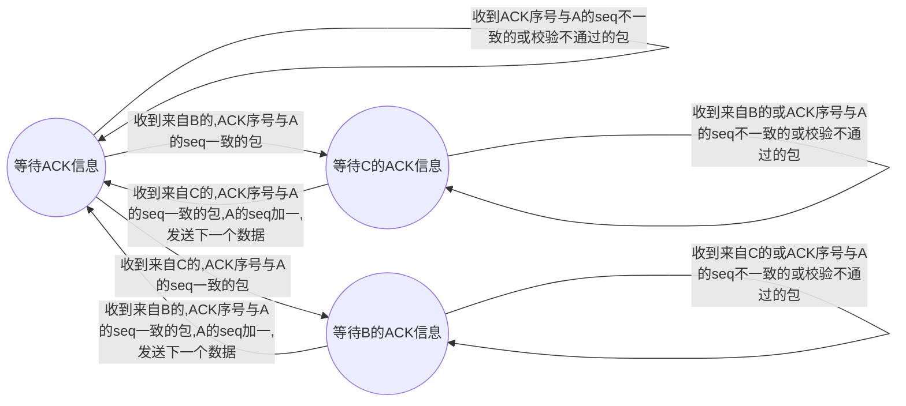
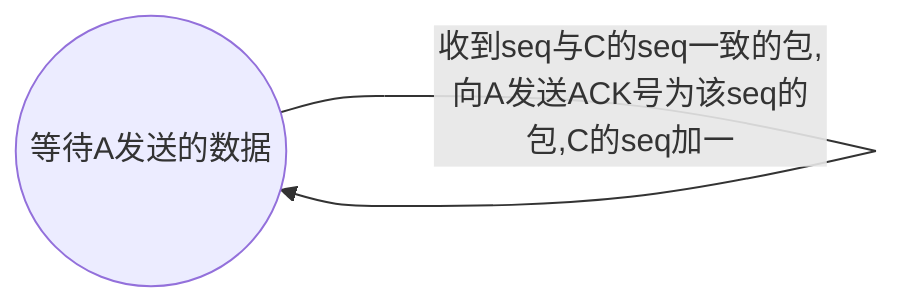

# 
计网作业5

姓名：王瀚霖
学号：181860092
邮箱：603102048@qq.com

------

### 第4章

R5. Why is it that voice and video traffic is often sent over TCP rather than UDP in today’s Internet? (Hint: The answer we are looking for has nothing to do with TCP’s congestion-control mechanism.) 

	答、因为现有大多数的防火墙会拦截UDP信息，使用UDP流量无法通过防火墙，只能用TCP来接收。

R8. Suppose that a Web server runs in Host C on port 80. Suppose this Web server uses persistent connections, and is currently receiving requests from two different Hosts, A and B. Are all of the requests being sent through the same socket at Host C? If they are being passed through different sockets, do both of the sockets have port 80? Discuss and explain.

	答、如果建立的是“persistent connections”，应使用TCP连接；这样，一个socket就包含了<src ip,src port,dst ip,dst port>这些信息；显然，C接收来自A和B的请求，A和B的ip地址不同，则通过的socket显然也不同；由于接收方都是C，所以dst port一定就是C的端口号80（源端口号未知），所以每个socket都会有端口80。

R14. True or false? 
a. Host Ais sending Host B a large file over a TCP connection. Assume Host B has no data to send Host A. Host B will not send acknowledgments to Host Abecause Host B cannot piggyback the acknowledgments on data.
 b. The size of the TCPrwnd never changes throughout the duration of the connection.
 c. Suppose Host Ais sending Host B a large file over a TCPconnection. The number of unacknowledged bytes that Asends cannot exceed the size of the receive buffer. 
d. Suppose Host Ais sending a large file to Host B over a TCPconnection. If the sequence number for a segment of this connection is m, then the sequence number for the subsequent segment will necessarily be m + 1.
 e. The TCPsegment has a field in its header for rwnd.
 f. Suppose that the last SampleRTT in a TCPconnection is equal to 1 sec. The current value of TimeoutInterval for the connection will necessarily be ≥ 1 sec.
 g. Suppose Host Asends one segment with sequence number 38 and 4 bytes of data over a TCPconnection to Host B. In this same segment the acknowledgment number is necessarily 42.  

	答、
	a、错；TCP协议下主机B必须发送确认ACK；如果B不能随数据捎带确认，B需要单独发ACK信息；
	b、错；$RWND = buffersize - (lastbyte_recieved - lastbyte_read)$，而`lastbyte_read`是动态变化的，因而导致`RWND`动态变化；
	c、对；主机A会根据`RWND`信息动态调整自己的发送字节数，确保不超过接收缓存的大小；
	d、错；报文段的序号记录的是这个报文段中第一个字节在流中的序号；若这个报文段长度超过一个字节则自然后继报文段序号不会是`m+1`；
	e、对；
	f、错；对于该连接的`TimeoutInterval`的当前值会由`EstimatedRTT`与`SampleRTT`共同计算得出，计算的结果可能大于等于1s，也可能比1s小；而且如果恰好最后发生了重传的话，计算的`TimeoutInterval`小于1s的可能性很大；
	g、错；如果38号字节数据丢失，没有被接收到，则接收方返回的ACK号还会是38.

P1. Suppose Client Ainitiates a Telnet session with Server S. At about the same time, Client B also initiates a Telnet session with Server S. Provide possible source and destination port numbers for 
a. The segments sent from Ato S. 
b. The segments sent from B to S. 
c. The segments sent from S to A. 
d. The segments sent from S to B. 
e. If Aand B are different hosts, is it possible that the source port number in the segments from Ato S is the same as that from B to S? 
f. How about if they are the same host? 

	答、TCP段结构中端口地址是16bit，其中端口号小于256的一般分配给服务器，而TCP服务的端口号一般使用1——1023的,telnet端口为23，故假设A的端口号是300，B的端口号是360，S的端口号是23；则：
	a、源端口号为300，目的端口号为23；	b、源端口号为360，目的端口号为23；	c、源端口号为23，目的端口号为300；	d、源端口号为23，目的端口号为360；	e、如果A和B是不同的主机，则ip地址不同，故A、B的端口号可以相同，即A->S与B->S的源端口号可以相同；	f、若A、B是同一台主机，如果它们的端口号一样，则两个不同的用户进程对应了一个端口号，这样的话就无法区别了，所以不可以相同。

P19. Consider a scenario in which Host Awants to simultaneously send packets to Hosts B and C. Ais connected to B and C via a broadcast channel—a packet sent by Ais carried by the channel to both B and C. Suppose that the broadcast channel connecting A, B, and C can independently lose and corrupt packets (and so, for example, a packet sent from Amight be correctly received by B, but not by C). Design a stop-and-wait-like error-control protocol for reliably transferring packets from Ato B and C, such that Awill not get new data from the upper layer until it knows that both B and C have correctly received the current packet. Give FSM descriptions of Aand C. (Hint: The FSM for B should be essentially the same as for C.) Also, give a description of the packet format(s) used. 

	答、要实现A到B、C的可靠传输分组，应该满足：A要收到B和C的ACK之后才发送下一个数据，同时考虑到B或C可能一个正确接收到了另一个没有，这种情况下A会重发；为了避免重复接收包，还需要加入序列号来标记数据顺序；此外，为了保证数据传输的正确性，还可以加入校验和checksum；因此传输的报文应该具有：源IP地址，目的IP地址，序号seq，ACK号，checksum；A和C的状态机描述如下（A、B、C的seq都初始化为0）：

A:

C:

	PS：typora绘图实在一言难尽，但手绘又不清楚……麻烦学长学姐把pdf放大查看，实在抱歉  〒▽〒

P27. Host Aand B are communicating over a TCPconnection, and Host B has already received from Aall bytes up through byte 126. Suppose Host Athen sends two segments to Host B back-to-back. The first and second segments contain 80 and 40 bytes of data, respectively. In the first segment, the sequence number is 127, the source port number is 302, and the destination port number is 80. Host B sends an acknowledgment whenever it receives a segment from Host A. 
a. In the second segment sent from Host Ato B, what are the sequence number, source port number, and destination port number? 
b. If the first segment arrives before the second segment, in the acknowledgment of the first arriving segment, what is the acknowledgment number, the source port number, and the destination port number?
c. If the second segment arrives before the first segment, in the acknowledgment of the first arriving segment, what is the acknowledgment number? 
d. Suppose the two segments sent by Aarrive in order at B. The first acknowledgment is lost and the second acknowledgment arrives after the first timeout interval. Draw a timing diagram, showing these segments and all other segments and acknowledgments sent. (Assume there is no additional packet loss.) For each segment in your figure, provide the sequence number and the number of bytes of data; for each acknowledgment that you add, provide the acknowledgment number. 

	答、
	a、序号为`127 + 80 = 207`，源端口号是302，目的端口号是80；
	b、确认号即期望接收到的下一个字节编号，即207；源端口号是80，目的端口号是302；
	c、B在接收到第二个报文段后，仍然期望接收第一个报文段，故确认号是127；
	d、如下图所示：

P32. Consider the TCPprocedure for estimating RTT. Suppose that α = 0.1. Let SampleRTT1 be the most recent sample RTT, let SampleRTT2 be the next most recent sample RTT, and so on. 
a. For a given TCPconnection, suppose four acknowledgments have been returned with corresponding sample RTTs: SampleRTT4, SampleRTT3, SampleRTT2, and SampleRTT1. Express EstimatedRTT in terms of the four sample RTTs. 
b. Generalize your formula for n sample RTTs. 
c. For the formula in part (b) let n approach infinity. Comment on why this averaging procedure is called an exponential moving average. 

	答、
a、由题意，T4到T1依次到达
$$
EstimatedRTT=α*SampleRTT1+(1-α)*(α*SampleRTT2+(1-α)*(α*SampleRTT3+(1-α)*SampleRTT4)
$$
$$
=α*SampleRTT1+(1-α)*α*SampleRTT2+{(1-α)}^{2}*α*SampleRTT3+{(1-α)}^{3}*SampleRTT3
$$

$$
=0.1*SampleRTT1+0.09*SampleRTT2+0.081*SampleRTT3+0.729*SampleRTT3
$$

	b、一般化到n个RTT样本得（按照Tn到T1依次到达的顺序）：
$$
EstimatedRTT=α*SampleRTT1+(1-α)*α*SampleRTT2+{(1-α)}^{2}*α*SampleRTT3+……
$$

$$
+{(1-α)}^{n-2}*α*SampleRTT(n-1)+{(1-α)}^{n-1}*α*SampleRTTn
$$

$$
=\frac{α}{1-α}*\sum_{i=1}^{i=n}{(1-α)}^{i}*SampleRTTi
$$

$$
=0.1*SampleRTT1+0.9*0.1*SampleRTT2+……+{0.9}^{n-1}*0.1*SampleRTTn
$$

	c、令n->∞，得：
$$
EstimatedRTT=\frac{α}{1-α}*\sum_{i=1}^{i=∞}{(1-α)}^{i}*SampleRTTi
$$

$$
=\frac{1}{9}*\sum_{i=1}^{i=∞}{0.9}^{i}*SampleRTTi
$$

	根据上式可以看出，对于之前得到的`SampleRTT`而言，其对`EstimatedRTT`的影响权重会随着后续`SampleRTT`的到来而不断降低，而且每次都是以乘以一个0.9的形式降低，即为指数递减；这可能就是这个平均过程被称为指数移动平均的原因。

P40：题干略。

	答、
	a、慢启动阶段，拥塞窗口长度从1开始增长，每次翻倍；由此可判断时间段[1,6]与[23,26]是慢启动阶段；
	b、拥塞避免阶段，拥塞窗口长度线性增长，每次加一；由此可判断时间段[6,16]与[17,22]是拥塞避免阶段；
	c、由CWND减半而非减至1可知是由3个冗余ACK检测出来的；
	d、由CWND减至1而非减半可知是由超时检测出来的；
	e、第一次慢启动阶段是在CWND增至32结束，进而转为拥塞避免阶段的，故第一个传输轮回中ssthresh被设置为32；
	f、在第18个传输轮回中，之前经历了一次冗余ACK检测，故`ssthresh = CWND/2 = 42/2 = 21`；而`CWND = ssthresh + 3 = 24`；
	g、在第24个传输轮回中，之前经历了一次超时，故`ssthresh = CWND/2 = 29/2 = 14`；而`CWND = 1`；
	h、第一个传输轮回传输第1个报文段，第二个传输轮回传输第2、3个报文段，第三个传输轮回传输第4——7个报文段，第四个传输轮回传输第8——15个报文段，第五个传输轮回传输第16——31个报文段，第六个传输轮回传输第32——63个报文段（慢启动阶段，此时一个轮回传输32个报文段）；第七个传输轮回传输第64——96个报文段（拥塞避免阶段，此时一个轮回传输33个报文段）；故在第七个轮回内发送第70个报文段；
	i、第26个轮回进行时CWND为8，ssthresh为14；若第26个轮回后检测到3个冗余ACK，则`ssthresh = CWND/2 = 8/2 = 4`；`CWND = ssthresh + 3 = 7`；
	j、采用TCP Tahoe，则在第16个传输轮回收到3个冗余ACK后，`ssthresh = 21`，同时CWND置为1，回到慢启动阶段（第17个传输轮回）；故在第18个传输轮回中，`CWND = 2`;在第19个传输轮回中，`CWND = 4`，`ssthresh = 21`;
	k、在第22个传输轮回有超时事件，但这对于17——22传输轮回中发送了多少MSS无关：第17个传输轮回传输了1个；第18个传输轮回传输了2个；第19个传输轮回传输了4个；第20个传输轮回传输了8个；第21个传输轮回传输了16个；第22个传输轮回传输了21个；共传输了52个分组。

P45.题干略。

	证明、
	a、
	计算变化周期内传输的分组数量为：
$$
n=\sum_{i=\frac{W}{2}}^{i=W}i=(\frac{W}{2}+W)*(W-\frac{W}{2}+1)/2=\frac{3{W}^{2}}{8}+\frac{3W}{4}
$$
	故丢包率为：
$$
L=\frac{1}{n} = \frac{1}{\frac{3{W}^{2}}{8}+\frac{3W}{4}}
$$
	b、变化周期时间为：
$$
t=(\frac{W}{2}+1)*{RTT}
$$
	故平均速率为：
$$
\frac{n*MSS}{t}=\frac{(\frac{3{W}^{2}}{8}+\frac{3W}{4})*MSS}{(\frac{W}{2}+1)*{RTT}}=\frac{3W*MSS}{4*RTT}
$$
	又：
$$
L=\frac{1}{n} = \frac{1}{\frac{3{W}^{2}}{8}+\frac{3W}{4}}
$$
	当W很大时，有：
$$
L=\frac{1}{\frac{3{W}^{2}}{8}}=\frac{8}{3{W}^{2}}
$$
	推出：
$$
W=\sqrt{\frac{8}{3L}}
$$
	代入得平均速率为：
$$
\frac{\sqrt{6}}{2}*\frac{MSS}{RTT\sqrt{L}}≈\frac{1.22*MSS}{RTT\sqrt{L}}
$$

P46. Consider that only a single TCP(Reno) connection uses one 10Mbps link which does not buffer any data. Suppose that this link is the only congested link between the sending and receiving hosts. Assume that the TCPsender has a huge file to send to the receiver, and the receiver’s receive buffer is much larger than the congestion window. We also make the following assumptions: each TCPsegment size is 1,500 bytes; the two-way propagation delay of this connection is 150 msec; and this TCPconnection is always in congestion avoidance phase, that is, ignore slow start. 
a. What is the maximum window size (in segments) that this TCPconnection can achieve? 
b. What is the average window size (in segments) and average throughput (in bps) of this TCPconnection? 
c. How long would it take for this TCP connection to reach its maximum window again after recovering from a packet loss? 

	答、
	a、设该TCP连接能够取得的最大窗口长度为x个报文段，则应该有：
$$
10*{10}^{6} = \frac{1500*8*x}{150*{10}^{-3}}
$$
	解得x值为125，故最大窗口长度是125；
	b、CWND一旦达到125，如果CWND继续增加就会发生丢包事件，由题干慢启动阶段被忽略，所以丢包时CWND应该折半（向下取整，故初始为62），因此，平均窗口长度为：
$$
\frac{62+63+……+125}{63}=\frac{(62+125)*63}{63*2}=93.5
$$
	结果取整得94；取单位为bits/s则平均吞吐量为：
$$
\frac{94*1500*8}{150*{10}^{-3}}=7520000
$$
	即7.52Mbps。

	c、丢包恢复后，CWND折半成为62，因此再次恢复到最大窗口需要的时间为：
$$
(125-62)*150ms=9450ms=9.45s
$$

P50. Consider a simplified TCP’s AIMD algorithm where the congestion window size is measured in number of segments, not in bytes. In additive increase, the congestion window size increases by one segment in each RTT. In multiplicative decrease, the congestion window size decreases by half (if the result is not an integer, round down to the nearest integer). Suppose that two TCP connections, C1 and C2, share a single congested link of speed 30 segments per second. Assume that both C1 and C2 are in the congestion avoidance phase. Connection C1’s RTT is 50 msec and connection C2’s RTT is 100 msec. Assume that when the data rate in the link exceeds the link’s speed, all TCPconnections experience data segment loss. 
a. If both C1 and C2 at time t0 have a congestion window of 10 segments, what are their congestion window sizes after 1000 msec? 
b. In the long run, will these two connections get the same share of the bandwidth of the congested link? Explain. 

	解、
	a、共享的单一拥塞链路的速率是30个报文段每秒，即3个报文段每100ms；故t0时刻C1和C2具有10个报文段的拥塞窗口已经远远超出了链路的速率，在之后传播中均会折半：

| t0后经过时间/ms | C1拥塞窗口大小  | C2拥塞窗口大小 |
| --------------- | --------------- | -------------- |
| 0               | 10              | 10             |
| 50              | 5（折半）       | 10             |
| 100             | 2（折半）       | 5（折半）      |
| 150             | 1（折半）       | 5              |
| 200             | 1（无法减少了） | 2（折半）      |
| 250             | 1               | 2              |
| 300             | 1               | 1（折半）      |

	在200ms时，假设C1、C2发数据成功，则考虑200-300ms的传输过程：前50ms C1数据传输成功，100ms结束C1又传输了数据（假设C1窗口大小暂时不变），C2数据也传输成功；传输的报文段数量为：$(1+2+1)*2 = 8$（包含ACK）；考虑到是双向传递的，则单向传输相当于100ms传输了4个报文段；超过了链路的最大速率，所以还是要折半；在300ms时，C1、C2均发送1个报文段，仿照上述计算过程得到单向传输是100ms传输了3个报文段，没有超过链路的最大速率，成功传输；所以在350ms时，C1成功传输，所以接下来C1会将拥塞窗口大小加一后传输，即350ms时传播成为了C1传2个，C2传1个，超过了链路速率，所以均传输失败，C1折半，C2仍为1；接下来就是上述过程的重复，列表如下：

| 350  | 2（加一） | 1               |
| ---- | --------- | --------------- |
| 400  | 1（折半） | 1（无法减少了） |
| 450  | 2         | 1               |
| 500  | 1         | 1               |
| 550  | 2         | 1               |
| 600  | 1         |                 |
| 650  | 2         | 1               |
| 700  | 1         |                 |
| 750  | 2         | 1               |
| 800  | 1         |                 |
| 850  | 2         | 1               |
| 900  | 1         |                 |
| 950  | 2         | 1               |
| 1000 | 1         | 1               |

	故1000ms后二者的拥塞窗口大小均为1；

	b、根据a的分析可知，之后的传输情况会陷入一个循环中，考虑该循环中的一个过程：首先C1、C2均发一个报文段，前50msC1的报文段传输完毕（来回），C2刚传到接收方，故C1是C2带宽的2倍；后50ms C1会发2个报文段，同时C1的报文段在后50ms传输完毕（来回），C2的报文段只是传输回来，所以这个过程中C1是C2带宽的4倍；综合下来，C1占有共享链路的带宽是C2的：$\frac{1}{2}*2+\frac{1}{2}*4=3$倍。

P52. Consider a modification to TCP’s congestion control algorithm. Instead of additive increase, we can use multiplicative increase. A TCP sender increases its window size by a small positive constant a (0 < a < 1) whenever it receives a valid ACK. Find the functional relationship between loss rate L and maximum congestion window W. Argue that for this modified TCP, regardless of TCP’s average throughput, a TCPconnection always spends the same amount of time to increase its congestion window size from W/2 to W. 

	解、同样的，考虑CWND从$\frac{W}{2}$增长到W的过程：

	设：
$$
\frac{W}{2}(1+α)^x=W
$$
	得：
$$
(1+α)^x=2
$$
	则计算变化周期内传输的分组数量为：
$$
n=\frac{W}{2}+\frac{W}{2}(1+α)+\frac{W}{2}{(1+α)}^{2}+\frac{W}{2}{(1+α)}^{3}+……+W
$$

$$
=\frac{W}{2}[1+(1+α)+{(1+α)}^{2}+……+{(1+α)}^{x}]
$$

$$
=\frac{W}{2}[\frac{1-{(1+α)^{x+1}}}{1-(1+α)}]=\frac{W}{2}[\frac{1-2*(1+α)}{1-(1+α)}]=\frac{W(2α+1)}{2α}
$$

	丢包率为：
$$
L=\frac{1}{n}=\frac{2α}{W(2α+1)}
$$
	考察从$\frac{W}{2}$增加到W的时间，为：
$$
x*RTT=\log_{1+α}{2}*RTT
$$
	由上式可以看出，增加需要的时间是一个只与α与RTT有关的值，因此无论TCP的平均吞吐量如何，增加所需要的时间总是相同的。