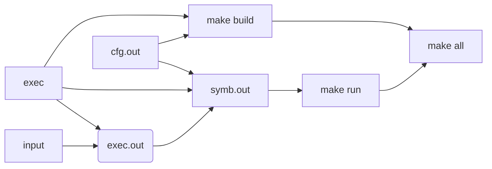

<font size=3 color=green face="楷体">若干变量声明</font>

`CFLAGS=-g -O0 -include ${APEX}/llvm/common.h -Wall -Werror=implicit-function-declaration -fno-builtin -std=c99 -Wno-unused-variable -Wno-unused-value -DNDEBUG`

`CLANG=${APEX}/llvm/clang-3.7`
`OPT=${APEX}/llvm/opt -load ${APEX}/llvm/LLVMHello.so`
`LLC=${APEX}/llvm/llc`
`LD=gcc`
`CC=gcc`
`T=$(shell basename $$PWD)` 

<table><tr><td bgcolor=#D1EEEE><font color=green size=3 face="楷体">执行一个shell函数，即生成一个Shell程序执行basename $PWD，即返回当前所在目录</font></td></tr></table>
`.PHONY: all clean run build` 

<table><tr><td bgcolor=#D1EEEE><font size=3 color=green face="楷体">运行方法为：make all 、make clean 、make run 、make build

`all: build run` 

<table><tr><td bgcolor=#D1EEEE><font size=3 color=green face="楷体">all 依赖于build、run</font></td></tr></table>
`run: symb.out` 

<table><tr><td bgcolor=#D1EEEE><font size=3 color=green face="楷体">run依赖于symb.out</font></td></tr></table>
`build: exec cfg.out`  

<table><tr><td bgcolor=#D1EEEE><font size=3 color=green face="楷体">build依赖于exec 、cfg.out

`clean:
	rm -f exec.out symb.out *.log` 

<table><tr><td bgcolor=#D1EEEE><font size=3 color=green face="楷体">make clean效果：删除 exec.out symb.out与所有log记录文件</font></td></tr></table>
`exec.out: exec input `

<table><tr><td bgcolor=#D1EEEE><font size=3 color=green face="楷体">exec.out依赖于exec、input


```makefile
-./exec $$(cat input)> stdout
```

<table><tr><td bgcolor=#D1EEEE><font size=3 color=green face="楷体">前面加了一个小减号的意思就是，也许某些文件出现问题，但不要管，继续做后面的事；以input为输入执行exec文件，将执行结果打印到标准输出上</font></td></tr></table>
`symb.out: exec exec.out cfg.out
	${APEX}/script/symbexec.py -out symb.out -cfg cfg.out -llvm llvm.out -exec exec.out -args args.out `

<table><tr><td bgcolor=#D1EEEE><font size=3 color=red face="楷体">???运行symbexec.py，.out文件为可执行文件？链接库文件？</font></td></tr></table>
`input: ../input`
	`ln -fs $< $@`


<table><tr><td bgcolor=#D1EEEE><font size=3 color=green face="楷体">解释后为In -fs ../input input，即建立input间的链接

`# exec.asm: exec`

`# objdump -dS -M intel $< > $@`

<table><tr><td bgcolor=#D1EEEE><font size=3 color=green face="楷体">注释：用于生成反汇编，-M用于自动寻找源文件中包含的头文件,生成exec的反汇编文件 exec.asm

# 

`# exec.dbg: exec`

`# readelf --debug-dump=info $< > $@`

<table><tr><td bgcolor=#D1EEEE><font size=3 color=green face="楷体">注释：用于生成elf，类似上面的asm

`%.s: %.bc`

<table><tr><td bgcolor=#D1EEEE><font size=3 color=green face="楷体">所有的.s文件以对应的bc文件为基础</font></td></tr></table>
`${LLC} -O0 $< -o $@`

<table><tr><td bgcolor=#D1EEEE><font size=3 color=green face="楷体">即apex/llvm/llc - O0 .bc -o .s  ，利用llc先将bc编译为汇编，再利用后续的gcc编译为可执行文件

`%.o: %.s
	${CC} -c $<`

 <table><tr><td bgcolor=#D1EEEE><font size=3 color=green face="楷体">即gcc -c .s
`.DELETE_ON_ERROR:`


 <table><tr><td bgcolor=#D1EEEE><font size=3 color=green face="楷体">此makefile中没有给出target exec与cfg.out的生成命令？？？以他们为依赖项的build与run均无法运行……按照网站给出的操作流程猜测：首先运行directory A,在makefile1中生成了exec与cfg.out，会在directory B中也生成？？然后按照下面的流程图执行：



<table><tr><td bgcolor=#D1EEEE><font size=3 color=green face="楷体">在此过程中，运行了可执行文件exec并打印结果到stdout；</font></td></tr></table>
<table><tr><td bgcolor=#D1EEEE><font size=3 color=red face="楷体">	从上述流程图推测网站上描述的“Place the correct solution in directory B”描述的应该是input???但在makefile1中分析，make执行的源头是src.c？？？那“buggy submission”应该是src.c？？？input在makefile1中是什么？？？